## TIME SERIES ANALYSIS OF HOUSEHOLD ELECTRIC POWER CONSUMPTION ##


1.**ABSTRACT**

**Introduction:** Time Series analysis is “an ordered sequence of values of a variable at equally spaced time intervals.” It is used to understand the determining factors and structure behind the observed data, choose a model to forecast, thereby leading to better decision making.

The Time Series Analysis is applied for various purposes, such as:

* Stock Market Analysis 
* Economic Forecasting
* Inventory studies
* Budgetary Analysis 
* Census Analysis
* Yield Projection 
* Sales Forecasting
and more.
 
 Time series analysis is a statistical technique to analyze the pattern of data points taken over time to forecast the future. The major components or pattern that are analyzed through time series are:

* Trend- Increase or decrease in the series of data over longer a period.
* Seasonality- Fluctuations in the pattern due to seasonal determinants over a short period.
* Cyclicity - Variations occurring at irregular intervals due to certain circumstances. 
* Irregularity- Instability due to random factors that do not repeat in the pattern.

**Aim of the project:** To show how to build the simplest Long Short-Term Memory (LSTM) recurrent neural network for a time-series data.

**Description** : Measurements of electric power consumption in a house located in Sceaux (7km of Paris, France) between December 2006 and November 2010 (47 months) with one-minute sampling rate. Different electrical quantities and some sub-metering values are available.


2.**DATASET BACKGROUND** 

**Dataset Source:** [https://archive.ics.uci.edu/ml/datasets/Individual+household+electric+power+consumption](https://archive.ics.uci.edu/ml/datasets/Individual+household+electric+power+consumption)

**Data Set Information:**

This archive contains 2075259 measurements gathered in a house located in Sceaux (7km of Paris, France) between December 2006 and November 2010 (47 months).

**Notes:**

1.(global_active_power*1000/60 - sub_metering_1 - sub_metering_2 - sub_metering_3) represents the active energy consumed every minute (in watt hour) in the household by electrical equipment not measured in sub-meterings 1, 2 and 3.

2.The dataset contains some missing values in the measurements (nearly 1.25% of the rows). All calendar timestamps are present in the dataset but for some timestamps, the measurement values are missing: a missing value is represented by the absence of value between two consecutive semi-colon attribute separators. For instance, the dataset shows missing values on April 28, 2007.


**Attribute Information:**

**1.date:** Date in format dd/mm/yyyy

**2.time:** time in format hh:mm:ss

**3.global_active_power:** household global minute-averaged active power (in kilowatt)

**4.global_reactive_power:** household global minute-averaged reactive power (in kilowatt)

**5.voltage:** minute-averaged voltage (in volt)

**6.global_intensity:** household global minute-averaged current intensity (in ampere)

**7.sub_metering_1:** energy sub-metering No. 1 (in watt-hour of active energy). It corresponds to the kitchen, containing mainly a dishwasher, an oven and a microwave (hot plates are not electric but gas powered).

**8.sub_metering_2:** energy sub-metering No. 2 (in watt-hour of active energy). It corresponds to the laundry room, containing a washing-machine, a tumble-drier, a refrigerator and a light.

**9.sub_metering_3:** energy sub-metering No. 3 (in watt-hour of active energy). It corresponds to an electric water-heater and an air-conditioner.


```python
from google.colab import drive
drive.mount('/content/drive')
```

    Go to this URL in a browser: https://accounts.google.com/o/oauth2/auth?client_id=947318989803-6bn6qk8qdgf4n4g3pfee6491hc0brc4i.apps.googleusercontent.com&redirect_uri=urn%3aietf%3awg%3aoauth%3a2.0%3aoob&response_type=code&scope=email%20https%3a%2f%2fwww.googleapis.com%2fauth%2fdocs.test%20https%3a%2f%2fwww.googleapis.com%2fauth%2fdrive%20https%3a%2f%2fwww.googleapis.com%2fauth%2fdrive.photos.readonly%20https%3a%2f%2fwww.googleapis.com%2fauth%2fpeopleapi.readonly
    
    Enter your authorization code:
    ··········
    Mounted at /content/drive
    


```python
from google.colab import files
uploaded = files.upload()

import io
import pandas as pd
df = pd.read_fwf('household_power_consumption.txt')
df.to_csv('power_consumption.csv')

# Dataset is now stored in a Pandas Dataframe
```


     <input type="file" id="files-681d64ce-8b4d-48e7-b317-d8e671d85454" name="files[]" multiple disabled />
     <output id="result-681d64ce-8b4d-48e7-b317-d8e671d85454">
      Upload widget is only available when the cell has been executed in the
      current browser session. Please rerun this cell to enable.
      </output>
      <script src="/nbextensions/google.colab/files.js"></script> 


    Saving household_power_consumption.txt to household_power_consumption.txt
    


```python

data = pd.read_csv('household_power_consumption.txt', sep=";", parse_dates={'dt' : ['Date', 'Time']}, infer_datetime_format=True, low_memory=False, na_values=['nan','?'], index_col='dt');
data.columns = ["Global_active_power","Global_reactive_power","Voltage","Global_intensity","Sub_metering_1","Sub_metering_2","Sub_metering_3"]
df = data.iloc[:]
df.head()
```


<div>
<style scoped>
    .dataframe tbody tr th:only-of-type {
        vertical-align: middle;
    }

    .dataframe tbody tr th {
        vertical-align: top;
    }

    .dataframe thead th {
        text-align: right;
    }
</style>
<table border="1" class="dataframe">
  <thead>
    <tr style="text-align: right;">
      <th></th>
      <th>Global_active_power</th>
      <th>Global_reactive_power</th>
      <th>Voltage</th>
      <th>Global_intensity</th>
      <th>Sub_metering_1</th>
      <th>Sub_metering_2</th>
      <th>Sub_metering_3</th>
    </tr>
    <tr>
      <th>dt</th>
      <th></th>
      <th></th>
      <th></th>
      <th></th>
      <th></th>
      <th></th>
      <th></th>
    </tr>
  </thead>
  <tbody>
    <tr>
      <th>2006-12-16 17:24:00</th>
      <td>4.216</td>
      <td>0.418</td>
      <td>234.84</td>
      <td>18.4</td>
      <td>0.0</td>
      <td>1.0</td>
      <td>17.0</td>
    </tr>
    <tr>
      <th>2006-12-16 17:25:00</th>
      <td>5.360</td>
      <td>0.436</td>
      <td>233.63</td>
      <td>23.0</td>
      <td>0.0</td>
      <td>1.0</td>
      <td>16.0</td>
    </tr>
    <tr>
      <th>2006-12-16 17:26:00</th>
      <td>5.374</td>
      <td>0.498</td>
      <td>233.29</td>
      <td>23.0</td>
      <td>0.0</td>
      <td>2.0</td>
      <td>17.0</td>
    </tr>
    <tr>
      <th>2006-12-16 17:27:00</th>
      <td>5.388</td>
      <td>0.502</td>
      <td>233.74</td>
      <td>23.0</td>
      <td>0.0</td>
      <td>1.0</td>
      <td>17.0</td>
    </tr>
    <tr>
      <th>2006-12-16 17:28:00</th>
      <td>3.666</td>
      <td>0.528</td>
      <td>235.68</td>
      <td>15.8</td>
      <td>0.0</td>
      <td>1.0</td>
      <td>17.0</td>
    </tr>
  </tbody>
</table>
</div>


I parsed the **Date** and **Time** and put it as one column of time and converted date to time-series type


```python
df.shape
```


    (2075259, 7)


```python
df.info()
```

    <class 'pandas.core.frame.DataFrame'>
    DatetimeIndex: 2075259 entries, 2006-12-16 17:24:00 to 2010-11-26 21:02:00
    Data columns (total 7 columns):
    Global_active_power      float64
    Global_reactive_power    float64
    Voltage                  float64
    Global_intensity         float64
    Sub_metering_1           float64
    Sub_metering_2           float64
    Sub_metering_3           float64
    dtypes: float64(7)
    memory usage: 126.7 MB
    


```python
df.dtypes
```


    Global_active_power      float64
    Global_reactive_power    float64
    Voltage                  float64
    Global_intensity         float64
    Sub_metering_1           float64
    Sub_metering_2           float64
    Sub_metering_3           float64
    dtype: object


```python
df.head()
```


<div>
<style scoped>
    .dataframe tbody tr th:only-of-type {
        vertical-align: middle;
    }

    .dataframe tbody tr th {
        vertical-align: top;
    }

    .dataframe thead th {
        text-align: right;
    }
</style>
<table border="1" class="dataframe">
  <thead>
    <tr style="text-align: right;">
      <th></th>
      <th>Global_active_power</th>
      <th>Global_reactive_power</th>
      <th>Voltage</th>
      <th>Global_intensity</th>
      <th>Sub_metering_1</th>
      <th>Sub_metering_2</th>
      <th>Sub_metering_3</th>
    </tr>
    <tr>
      <th>dt</th>
      <th></th>
      <th></th>
      <th></th>
      <th></th>
      <th></th>
      <th></th>
      <th></th>
    </tr>
  </thead>
  <tbody>
    <tr>
      <th>2006-12-16 17:24:00</th>
      <td>4.216</td>
      <td>0.418</td>
      <td>234.84</td>
      <td>18.4</td>
      <td>0.0</td>
      <td>1.0</td>
      <td>17.0</td>
    </tr>
    <tr>
      <th>2006-12-16 17:25:00</th>
      <td>5.360</td>
      <td>0.436</td>
      <td>233.63</td>
      <td>23.0</td>
      <td>0.0</td>
      <td>1.0</td>
      <td>16.0</td>
    </tr>
    <tr>
      <th>2006-12-16 17:26:00</th>
      <td>5.374</td>
      <td>0.498</td>
      <td>233.29</td>
      <td>23.0</td>
      <td>0.0</td>
      <td>2.0</td>
      <td>17.0</td>
    </tr>
    <tr>
      <th>2006-12-16 17:27:00</th>
      <td>5.388</td>
      <td>0.502</td>
      <td>233.74</td>
      <td>23.0</td>
      <td>0.0</td>
      <td>1.0</td>
      <td>17.0</td>
    </tr>
    <tr>
      <th>2006-12-16 17:28:00</th>
      <td>3.666</td>
      <td>0.528</td>
      <td>235.68</td>
      <td>15.8</td>
      <td>0.0</td>
      <td>1.0</td>
      <td>17.0</td>
    </tr>
  </tbody>
</table>
</div>


```python
df.describe()
```


<div>
<style scoped>
    .dataframe tbody tr th:only-of-type {
        vertical-align: middle;
    }

    .dataframe tbody tr th {
        vertical-align: top;
    }

    .dataframe thead th {
        text-align: right;
    }
</style>
<table border="1" class="dataframe">
  <thead>
    <tr style="text-align: right;">
      <th></th>
      <th>Global_active_power</th>
      <th>Global_reactive_power</th>
      <th>Voltage</th>
      <th>Global_intensity</th>
      <th>Sub_metering_1</th>
      <th>Sub_metering_2</th>
      <th>Sub_metering_3</th>
    </tr>
  </thead>
  <tbody>
    <tr>
      <th>count</th>
      <td>2.049280e+06</td>
      <td>2.049280e+06</td>
      <td>2.049280e+06</td>
      <td>2.049280e+06</td>
      <td>2.049280e+06</td>
      <td>2.049280e+06</td>
      <td>2.049280e+06</td>
    </tr>
    <tr>
      <th>mean</th>
      <td>1.091615e+00</td>
      <td>1.237145e-01</td>
      <td>2.408399e+02</td>
      <td>4.627759e+00</td>
      <td>1.121923e+00</td>
      <td>1.298520e+00</td>
      <td>6.458447e+00</td>
    </tr>
    <tr>
      <th>std</th>
      <td>1.057294e+00</td>
      <td>1.127220e-01</td>
      <td>3.239987e+00</td>
      <td>4.444396e+00</td>
      <td>6.153031e+00</td>
      <td>5.822026e+00</td>
      <td>8.437154e+00</td>
    </tr>
    <tr>
      <th>min</th>
      <td>7.600000e-02</td>
      <td>0.000000e+00</td>
      <td>2.232000e+02</td>
      <td>2.000000e-01</td>
      <td>0.000000e+00</td>
      <td>0.000000e+00</td>
      <td>0.000000e+00</td>
    </tr>
    <tr>
      <th>25%</th>
      <td>3.080000e-01</td>
      <td>4.800000e-02</td>
      <td>2.389900e+02</td>
      <td>1.400000e+00</td>
      <td>0.000000e+00</td>
      <td>0.000000e+00</td>
      <td>0.000000e+00</td>
    </tr>
    <tr>
      <th>50%</th>
      <td>6.020000e-01</td>
      <td>1.000000e-01</td>
      <td>2.410100e+02</td>
      <td>2.600000e+00</td>
      <td>0.000000e+00</td>
      <td>0.000000e+00</td>
      <td>1.000000e+00</td>
    </tr>
    <tr>
      <th>75%</th>
      <td>1.528000e+00</td>
      <td>1.940000e-01</td>
      <td>2.428900e+02</td>
      <td>6.400000e+00</td>
      <td>0.000000e+00</td>
      <td>1.000000e+00</td>
      <td>1.700000e+01</td>
    </tr>
    <tr>
      <th>max</th>
      <td>1.112200e+01</td>
      <td>1.390000e+00</td>
      <td>2.541500e+02</td>
      <td>4.840000e+01</td>
      <td>8.800000e+01</td>
      <td>8.000000e+01</td>
      <td>3.100000e+01</td>
    </tr>
  </tbody>
</table>
</div>


```python
df.columns
```


    Index(['Global_active_power', 'Global_reactive_power', 'Voltage',
           'Global_intensity', 'Sub_metering_1', 'Sub_metering_2',
           'Sub_metering_3'],
          dtype='object')


3.**EXPLORATORY DATA ANALYSIS (EDA)**

3.1 Dealing with missing values "*nan*"


```python
## Finding columns that have "nan" values

droping_list_all=[]
for j in range(0,7):
    if not df.iloc[:, j].notnull().all():
        droping_list_all.append(j)        
        #print(df.iloc[:,j].unique())
droping_list_all
```


    [0, 1, 2, 3, 4, 5, 6]


```python
## Filling nan values with mean in any columns

for j in range(0,7):        
        df.iloc[:,j]=df.iloc[:,j].fillna(df.iloc[:,j].mean())
```


```python
## Making sure there are no "nan" values
df.isnull().sum()
```


    Global_active_power      0
    Global_reactive_power    0
    Voltage                  0
    Global_intensity         0
    Sub_metering_1           0
    Sub_metering_2           0
    Sub_metering_3           0
    dtype: int64


There are no null values after processing the data

3.2 Data Visualization

**I have resampled over day and shown that the sum and mean of Global_active_power . We can observe that both have similar structure.**


```python
import pandas as pd 
import matplotlib.pyplot as plt
import seaborn as sns
```


```python
df.Global_active_power.resample('D').sum().plot(title='Global_active_power resampled over day for sum',figsize=(30, 5)) 
plt.tight_layout()
plt.show()   

df.Global_active_power.resample('D').mean().plot(title='Global_active_power resampled over day for mean', color='red',figsize=(30, 5))
plt.tight_layout()
plt.show()
```


**Below I have shown mean and std of 'Global_intensity' resampled over day**


```python
r = df.Global_intensity.resample('D').agg(['mean', 'std'])
r.plot(subplots = True, title='Global_intensity resampled over day',figsize=(40, 10))
plt.show()
```


**Mean and STD of 'Global_reactive_power' resampled over day**


```python
r2 = df.Global_reactive_power.resample('D').agg(['mean', 'std'])
r2.plot(subplots = True, title='Global_reactive_power resampled over day', color='red',figsize=(40, 10))
plt.show()
```


**Sum of "*Global_active_power*" resampled over month**


```python
df['Global_active_power'].resample('M').mean().plot(kind='bar',figsize=(20, 5))
plt.xticks(rotation=80)
plt.ylabel('Global_active_power')
plt.title('Global_active_power per month (averaged over month)')
plt.show()
```


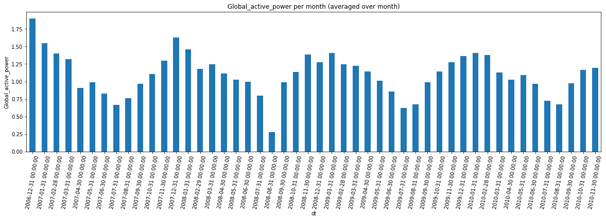


**Mean of '*Global_active_power*' resampled over quarter**


```python
df['Global_active_power'].resample('Q').mean().plot(kind='bar',figsize=(10, 5))
plt.xticks(rotation=80)
plt.ylabel('Global_active_power')
plt.title('Global_active_power per quarter (averaged over quarter)')
plt.show()
```


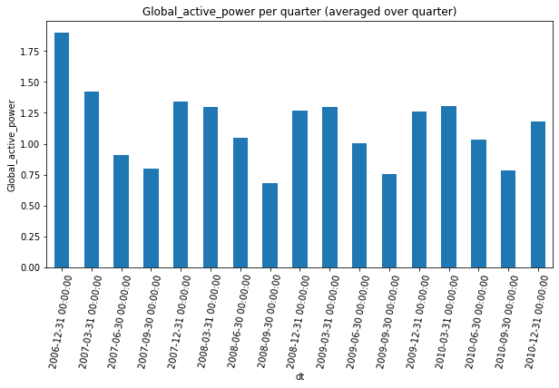


**It is important to note from above two plots that resampling over larger time inteval, will diminish the periodicity of system as we expect. This is important for machine learning feature engineering**

**Mean of 'Voltage' resampled over month**


```python
df['Voltage'].resample('M').mean().plot(kind='bar', color='red',figsize=(20,5))
plt.xticks(rotation=80)
plt.ylabel('Voltage')
plt.title('Voltage per quarter (summed over quarter)')
plt.show()
```


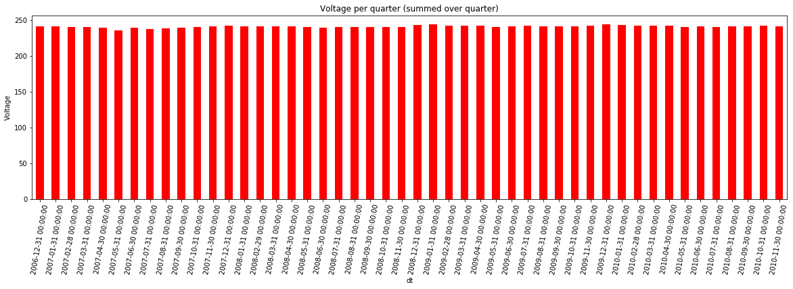


```python
df['Sub_metering_1'].resample('M').mean().plot(kind='bar', color='orange',figsize=(15,5))
plt.xticks(rotation=80)
plt.ylabel('Sub_metering_1')
plt.title('Sub_metering_1 per quarter (summed over quarter)')
plt.show()
```


**From the above plots it is learnt that the mean of 'Volage' over month is pretty much constant compared to other features. This is significant in feature selection**


**Mean of different features resampled over day**


```python
cols = [0, 1, 2, 3, 5, 6]
i = 1
groups=cols
values = df.resample('D').mean().values
# plot each column
plt.figure(figsize=(35, 20))
for group in groups:
	plt.subplot(len(cols), 1, i)
	plt.plot(values[:, group])
	plt.title(df.columns[group], y=0.75, loc='right')
	i += 1
plt.show()
```


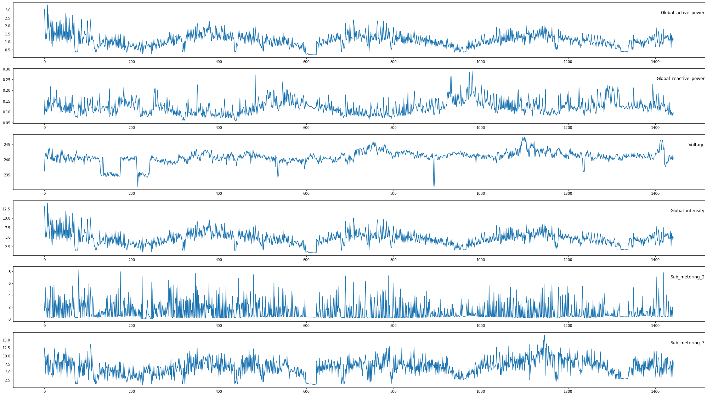


**Resampling over week and computing mean**


```python
df.Global_reactive_power.resample('W').mean().plot(color='y', legend=True,figsize=(35, 10))
df.Global_active_power.resample('W').mean().plot(color='r', legend=True,figsize=(35, 10))
df.Sub_metering_1.resample('W').mean().plot(color='b', legend=True,figsize=(35, 10))
df.Global_intensity.resample('W').mean().plot(color='g', legend=True,figsize=(35, 10))
plt.figure(figsize=(35, 20)).show()

```


    <Figure size 2520x1440 with 0 Axes>


**Hist plot of the mean of different features resampled over month**


```python
df.Global_active_power.resample('M').mean().plot(kind='hist', color='r', legend=True,figsize=(25, 5) )
df.Global_reactive_power.resample('M').mean().plot(kind='hist',color='b', legend=True,figsize=(25, 5))
#df.Voltage.resample('M').sum().plot(kind='hist',color='g', legend=True)
df.Global_intensity.resample('M').mean().plot(kind='hist', color='g', legend=True,figsize=(25, 5))
df.Sub_metering_1.resample('M').mean().plot(kind='hist', color='y', legend=True,figsize=(25, 5))
plt.show()
```


**Correlation between "Global_intensity" ,"Global_active_power"**


```python
data_returns = df.pct_change()
sns.jointplot(x='Global_intensity', y='Global_active_power', data=data_returns)
plt.figure(figsize=(50,50))
plt.show()
```


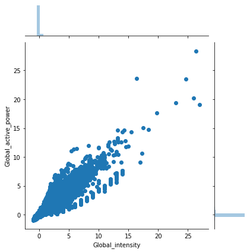


    <Figure size 3600x3600 with 0 Axes>


**correlations between 'Voltage' and  'Global_active_power'**


```python
sns.jointplot(x='Voltage', y='Global_active_power', data=data_returns) 
plt.figure(figsize=(50,50))
plt.show()
```


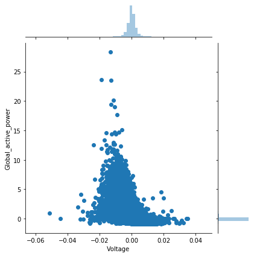


    <Figure size 3600x3600 with 0 Axes>


3.3 Correlation among features


```python
## Finding correlation among the features

plt.figure(figsize=(8,8))
plt.matshow(df.corr(method='spearman'),vmax=1,vmin=-1,cmap='RdPu',fignum=1)
plt.title('without resampling', size=15)
plt.colorbar()
plt.show()
```


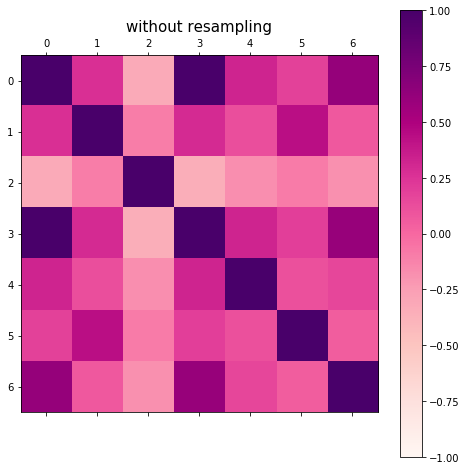


**Correlations of mean of features resampled over months and year**


```python
plt.figure(figsize=(8,8))
plt.matshow(df.resample('M').mean().corr(method='spearman'),vmax=1,vmin=-1,cmap='GnBu',fignum=1)
plt.title('resampled over month', size=15)
plt.colorbar()
plt.margins(0.02)
plt.figure(figsize=(8,8))
plt.matshow(df.resample('A').mean().corr(method='spearman'),vmax=1,vmin=-1,cmap='OrRd',fignum=2)
plt.title('resampled over year', size=15)
plt.colorbar()
plt.show()
```


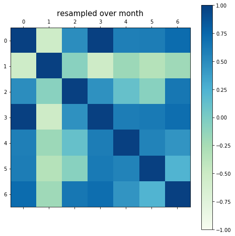


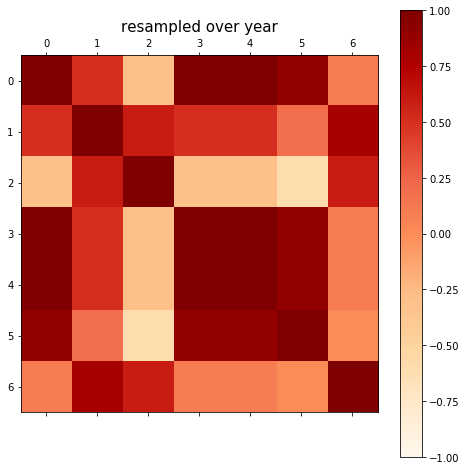


Using resampling techniques we can change the correlation among the features. This is important for feature engineering.

4.**MACHINE LEARNING : LSTM Data Preparation and feature engineering**


4.1 Long-Short Term Memory (LSTM) Data Preparation and Feature Engineering

I will apply recurrent neural network (LSTM) which is best suited for time-seriers and sequential problem. 


```python
def series_to_supervised(data, n_in=1, n_out=1, dropnan=True):
	n_vars = 1 if type(data) is list else data.shape[1]
	dff = pd.DataFrame(data)
	cols, names = list(), list()
	# input sequence (t-n, ... t-1)
	for i in range(n_in, 0, -1):
		cols.append(dff.shift(i))
		names += [('var%d(t-%d)' % (j+1, i)) for j in range(n_vars)]
	# forecast sequence (t, t+1, ... t+n)
	for i in range(0, n_out):
		cols.append(dff.shift(-i))
		if i == 0:
			names += [('var%d(t)' % (j+1)) for j in range(n_vars)]
		else:
			names += [('var%d(t+%d)' % (j+1, i)) for j in range(n_vars)]
	# put it all together
	agg = pd.concat(cols, axis=1)
	agg.columns = names
	# drop rows with NaN values
	if dropnan:
		agg.dropna(inplace=True)
	return agg
```

In order to reduce the computation time, and also get a quick result to test the model. One can resmaple the data over hour (the original data are given in 
minutes). This will reduce the size of data from 2075259 to 34589 but keep the overall strucure of data as shown in the above


```python
import sys 
import numpy as np # linear algebra
from scipy.stats import randint
import pandas as pd # data processing, CSV file I/O (e.g. pd.read_csv), data manipulation as in SQL
import matplotlib.pyplot as plt # this is used for the plot the graph 
import seaborn as sns # used for plot interactive graph. 
from sklearn.model_selection import train_test_split # to split the data into two parts
#from sklearn.cross_validation import KFold # use for cross validation
from sklearn.model_selection import train_test_split
from sklearn.preprocessing import StandardScaler # for normalization
from sklearn.preprocessing import MinMaxScaler
from sklearn.pipeline import Pipeline # pipeline making
from sklearn.model_selection import cross_val_score
from sklearn.feature_selection import SelectFromModel
from sklearn import metrics # for the check the error and accuracy of the model
from sklearn.metrics import mean_squared_error,r2_score

```


```python
## Resampling of data over hour

df_resample = df.resample('h').mean() 
df_resample.shape
```


    (34589, 7)


```python
from sklearn.preprocessing import MinMaxScaler

## * Note: I scale all features in range of [0,1].

## If you would like to train based on the resampled data (over hour), then used below
values = df_resample.values 


## full data without resampling
#values = df.values

# integer encode direction
# ensure all data is float
#values = values.astype('float32')
# normalize features
scaler = MinMaxScaler(feature_range=(0, 1))
scaled = scaler.fit_transform(values)
# frame as supervised learning
reframed = series_to_supervised(scaled, 1, 1)

# drop columns we don't want to predict
reframed.drop(reframed.columns[[8,9,10,11,12,13]], axis=1, inplace=True)
print(reframed.head())
```

       var1(t-1)  var2(t-1)  var3(t-1)  ...  var6(t-1)  var7(t-1)   var1(t)
    1   0.636816   0.295738   0.337945  ...   0.011366   0.782418  0.545045
    2   0.545045   0.103358   0.335501  ...   0.144652   0.782676  0.509006
    3   0.509006   0.110073   0.283802  ...   0.030869   0.774169  0.488550
    4   0.488550   0.096987   0.315987  ...   0.000000   0.778809  0.455597
    5   0.455597   0.099010   0.434417  ...   0.008973   0.798917  0.322555
    
    [5 rows x 8 columns]
    

Above I showed 7 input variables (input series) and the 1 output variable for 'Global_active_power' at the current time in hour (depending on resampling).


4.2 **Splitting the rest of data to train and validation sets**

First, I split the prepared dataset into train and test sets. To speed up the training of the model (for the sake of the demonstration), we will only train the model on the first year of data, then evaluate it on the next 3 years of data


```python
# split into train and test sets
values = reframed.values

n_train_time = 365*24
train = values[:n_train_time, :]
test = values[n_train_time:, :]
##test = values[n_train_time:n_test_time, :]
# split into input and outputs
train_X, train_y = train[:, :-1], train[:, -1]
test_X, test_y = test[:, :-1], test[:, -1]
# reshape input to be 3D [samples, timesteps, features]
train_X = train_X.reshape((train_X.shape[0], 1, train_X.shape[1]))
test_X = test_X.reshape((test_X.shape[0], 1, test_X.shape[1]))
print(train_X.shape, train_y.shape, test_X.shape, test_y.shape) 
# We reshaped the input into the 3D format as expected by LSTMs, namely [samples, timesteps, features].
```

    (8760, 1, 7) (8760,) (25828, 1, 7) (25828,)
    

5.**MODEL ARCHITECTURE**

1.   LSTM with 100 neurons in the first visible layer
2.   dropout 20%
3.   1 neuron in the output layer for predicting Global_active_power
4.   The input shape will be 1 time step with 7 features.
5.   I use the Mean Absolute Error (MAE) loss function and the efficient Adam version of stochastic gradient descent
6.   The model will be fit for 20 training epochs with a batch size of 70


```python
## for Deep-learing:
import keras
from keras.layers import Dense
from keras.models import Sequential
from keras.utils import to_categorical
from keras.optimizers import SGD 
from keras.callbacks import EarlyStopping
from keras.utils import np_utils
import itertools
from keras.layers import LSTM
from keras.layers.convolutional import Conv1D
from keras.layers.convolutional import MaxPooling1D
from keras.layers import Dropout

import tensorflow.compat.v1 as tf
tf.disable_v2_behavior()
```

    Using TensorFlow backend.
    


<p style="color: red;">
The default version of TensorFlow in Colab will soon switch to TensorFlow 2.x.<br>
We recommend you <a href="https://www.tensorflow.org/guide/migrate" target="_blank">upgrade</a> now 
or ensure your notebook will continue to use TensorFlow 1.x via the <code>%tensorflow_version 1.x</code> magic:
<a href="https://colab.research.google.com/notebooks/tensorflow_version.ipynb" target="_blank">more info</a>.</p>


    WARNING:tensorflow:From /usr/local/lib/python3.6/dist-packages/tensorflow_core/python/compat/v2_compat.py:68: disable_resource_variables (from tensorflow.python.ops.variable_scope) is deprecated and will be removed in a future version.
    Instructions for updating:
    non-resource variables are not supported in the long term
    


```python
model = Sequential()
model.add(LSTM(100, input_shape=(train_X.shape[1], train_X.shape[2])))
model.add(Dropout(0.2))

model.add(Dense(1))
```

    WARNING:tensorflow:From /usr/local/lib/python3.6/dist-packages/keras/backend/tensorflow_backend.py:66: The name tf.get_default_graph is deprecated. Please use tf.compat.v1.get_default_graph instead.
    
    WARNING:tensorflow:From /usr/local/lib/python3.6/dist-packages/keras/backend/tensorflow_backend.py:541: The name tf.placeholder is deprecated. Please use tf.compat.v1.placeholder instead.
    
    WARNING:tensorflow:From /usr/local/lib/python3.6/dist-packages/keras/backend/tensorflow_backend.py:4432: The name tf.random_uniform is deprecated. Please use tf.random.uniform instead.
    
    WARNING:tensorflow:From /usr/local/lib/python3.6/dist-packages/keras/backend/tensorflow_backend.py:148: The name tf.placeholder_with_default is deprecated. Please use tf.compat.v1.placeholder_with_default instead.
    
    WARNING:tensorflow:From /usr/local/lib/python3.6/dist-packages/keras/backend/tensorflow_backend.py:3733: calling dropout (from tensorflow.python.ops.nn_ops) with keep_prob is deprecated and will be removed in a future version.
    Instructions for updating:
    Please use `rate` instead of `keep_prob`. Rate should be set to `rate = 1 - keep_prob`.
    


```python
model.compile(loss='mean_squared_error', optimizer='adam')
```

    WARNING:tensorflow:From /usr/local/lib/python3.6/dist-packages/keras/optimizers.py:793: The name tf.train.Optimizer is deprecated. Please use tf.compat.v1.train.Optimizer instead.
    
    


```python
model.summary()
```

    Model: "sequential_1"
    _________________________________________________________________
    Layer (type)                 Output Shape              Param #   
    =================================================================
    lstm_1 (LSTM)                (None, 100)               43200     
    _________________________________________________________________
    dropout_1 (Dropout)          (None, 100)               0         
    _________________________________________________________________
    dense_1 (Dense)              (None, 1)                 101       
    =================================================================
    Total params: 43,301
    Trainable params: 43,301
    Non-trainable params: 0
    _________________________________________________________________
    

5.1 Fit network


```python
# fit network

import tensorflow.compat.v1 as tf
tf.disable_v2_behavior()

history = model.fit(train_X, train_y, epochs=20, batch_size=70, validation_data=(test_X, test_y), verbose=2, shuffle=False)
```

    WARNING:tensorflow:From /usr/local/lib/python3.6/dist-packages/tensorflow_core/python/ops/math_grad.py:1424: where (from tensorflow.python.ops.array_ops) is deprecated and will be removed in a future version.
    Instructions for updating:
    Use tf.where in 2.0, which has the same broadcast rule as np.where
    WARNING:tensorflow:From /usr/local/lib/python3.6/dist-packages/keras/backend/tensorflow_backend.py:1033: The name tf.assign_add is deprecated. Please use tf.compat.v1.assign_add instead.
    
    WARNING:tensorflow:From /usr/local/lib/python3.6/dist-packages/keras/backend/tensorflow_backend.py:1020: The name tf.assign is deprecated. Please use tf.compat.v1.assign instead.
    
    WARNING:tensorflow:From /usr/local/lib/python3.6/dist-packages/keras/backend/tensorflow_backend.py:3005: The name tf.Session is deprecated. Please use tf.compat.v1.Session instead.
    
    Train on 8760 samples, validate on 25828 samples
    Epoch 1/20
    WARNING:tensorflow:From /usr/local/lib/python3.6/dist-packages/keras/backend/tensorflow_backend.py:190: The name tf.get_default_session is deprecated. Please use tf.compat.v1.get_default_session instead.
    
    WARNING:tensorflow:From /usr/local/lib/python3.6/dist-packages/keras/backend/tensorflow_backend.py:197: The name tf.ConfigProto is deprecated. Please use tf.compat.v1.ConfigProto instead.
    
    WARNING:tensorflow:From /usr/local/lib/python3.6/dist-packages/keras/backend/tensorflow_backend.py:207: The name tf.global_variables is deprecated. Please use tf.compat.v1.global_variables instead.
    
    WARNING:tensorflow:From /usr/local/lib/python3.6/dist-packages/keras/backend/tensorflow_backend.py:216: The name tf.is_variable_initialized is deprecated. Please use tf.compat.v1.is_variable_initialized instead.
    
    WARNING:tensorflow:From /usr/local/lib/python3.6/dist-packages/keras/backend/tensorflow_backend.py:223: The name tf.variables_initializer is deprecated. Please use tf.compat.v1.variables_initializer instead.
    
     - 7s - loss: 0.0194 - val_loss: 0.0112
    Epoch 2/20
     - 2s - loss: 0.0122 - val_loss: 0.0101
    Epoch 3/20
     - 2s - loss: 0.0112 - val_loss: 0.0094
    Epoch 4/20
     - 2s - loss: 0.0107 - val_loss: 0.0092
    Epoch 5/20
     - 2s - loss: 0.0106 - val_loss: 0.0093
    Epoch 6/20
     - 2s - loss: 0.0106 - val_loss: 0.0092
    Epoch 7/20
     - 2s - loss: 0.0105 - val_loss: 0.0093
    Epoch 8/20
     - 2s - loss: 0.0106 - val_loss: 0.0092
    Epoch 9/20
     - 2s - loss: 0.0105 - val_loss: 0.0092
    Epoch 10/20
     - 2s - loss: 0.0105 - val_loss: 0.0092
    Epoch 11/20
     - 2s - loss: 0.0105 - val_loss: 0.0094
    Epoch 12/20
     - 2s - loss: 0.0104 - val_loss: 0.0092
    Epoch 13/20
     - 2s - loss: 0.0104 - val_loss: 0.0093
    Epoch 14/20
     - 2s - loss: 0.0104 - val_loss: 0.0093
    Epoch 15/20
     - 2s - loss: 0.0104 - val_loss: 0.0093
    Epoch 16/20
     - 2s - loss: 0.0103 - val_loss: 0.0093
    Epoch 17/20
     - 2s - loss: 0.0104 - val_loss: 0.0093
    Epoch 18/20
     - 2s - loss: 0.0104 - val_loss: 0.0093
    Epoch 19/20
     - 2s - loss: 0.0104 - val_loss: 0.0092
    Epoch 20/20
     - 2s - loss: 0.0104 - val_loss: 0.0093
    

5.2 Accuracy of Model 


```python
# summarize history for loss
plt.plot(history.history['loss'])
plt.plot(history.history['val_loss'])
plt.title('model loss')
plt.ylabel('loss')
plt.xlabel('epoch')
plt.legend(['train', 'test'], loc='upper right')
plt.show()

# make a prediction
yhat = model.predict(test_X)
test_X = test_X.reshape((test_X.shape[0], 7))
# invert scaling for forecast
inv_yhat = np.concatenate((yhat, test_X[:, -6:]), axis=1)
inv_yhat = scaler.inverse_transform(inv_yhat)
inv_yhat = inv_yhat[:,0]
# invert scaling for actual
test_y = test_y.reshape((len(test_y), 1))
inv_y = np.concatenate((test_y, test_X[:, -6:]), axis=1)
inv_y = scaler.inverse_transform(inv_y)
inv_y = inv_y[:,0]
# calculate RMSE
rmse = np.sqrt(mean_squared_error(inv_y, inv_yhat))
print('Test RMSE: %.3f' % rmse)
```


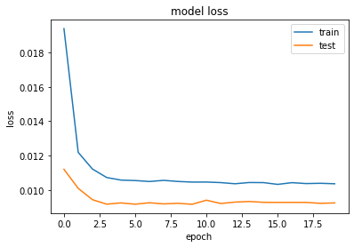


    Test RMSE: 0.619
    

In order to improve the model, one has to adjust epochs and batch_size. 

5.3 Model Prediction 

Predicting the '**Global_active_power**' for first 200 hours using the created model.


```python
## time steps, every step is one hour (you can easily convert the time step to the actual time index)
## for a demonstration purpose, I only compare the predictions in 200 hours.

aa=[x for x in range(200)]
plt.plot(aa, inv_y[:200], marker='.', label="actual")
plt.plot(aa, inv_yhat[:200], 'r', label="prediction")
plt.ylabel('Global_active_power', size=15)
plt.xlabel('Time step', size=15)
plt.legend(fontsize=15)
plt.show()
```


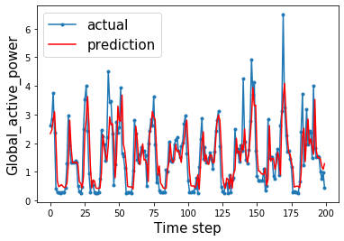


6.**FINAL REMARKS & FUTURE SCOPE**:
* Here I have used the LSTM neural network which is now the state-of-the-art for sequential problems.
* In order to reduce the computation time, and get some results quickly, I took the first year of data (resampled over hour) to train the model and the rest of data to test the model.
* I put together a very simple LSTM neural-network to show that one can obtain reasonable predictions. However number of rows is too high and as a result the computation is very time-consuming (even for the simple model it took few mins to be run on 2.8 GHz Intel Core i7 system). 
* Moreover, the neural-network architecture that I have designed is a low level model. It can be easily improved by adding CNN and dropout layers. The CNN is useful here since there are correlations in data (CNN layer is a good way to probe the local structure of data).
* Using spark (MLlib) on a system running with GPU we can obtain reasonable predictions with less computing time.

7.**SUMMARY**

**Title:** Individual household electric power consumption

**Author:** Srinath Botsa

**Why this dataset ?**

Time series analysis is a statistical technique to analyze the pattern of data points taken over time to forecast the future. The major components or pattern that are analyzed through time series are:

* Trend- Increase or decrease in the series of data over longer a period.
* Seasonality- Fluctuations in the pattern due to seasonal determinants over a short period.
* Cyclicity - Variations occurring at irregular intervals due to certain circumstances.
* Irregularity- Instability due to random factors that do not repeat in the pattern.

As this dataset is an observation of electricity consumption over a time period. It is suitable to do time-series analysis.

**Aim of the project:** To show how to build the simplest Long Short-Term Memory (LSTM) recurrent neural network for time-series data.

**Insights:**

**Visualization of the features averaged over month**


8.**REFERENCES:**

https://towardsdatascience.com/3-ways-to-load-csv-files-into-colab-7c14fcbdcb92

http://www.statsoft.com/textbook/time-series-analysis

https://stackoverflow.com/questions/31594549/how-do-i-change-the-figure-size-for-a-seaborn-plot

https://stackoverflow.com/questions/21546739/load-data-from-txt-with-pandas

 **Neural Networks(LSTM) Concepts:**

https://skymind.ai/wiki/lstm

https://colah.github.io/posts/2015-08-Understanding-LSTMs/

https://machinelearningmastery.com/use-features-lstm-networks-time-series-forecasting/

https://machinelearningmastery.com/how-to-develop-lstm-models-for-time-series-forecasting/

https://machinelearningmastery.com/time-series-prediction-lstm-recurrent-neural-networks-python-keras/


